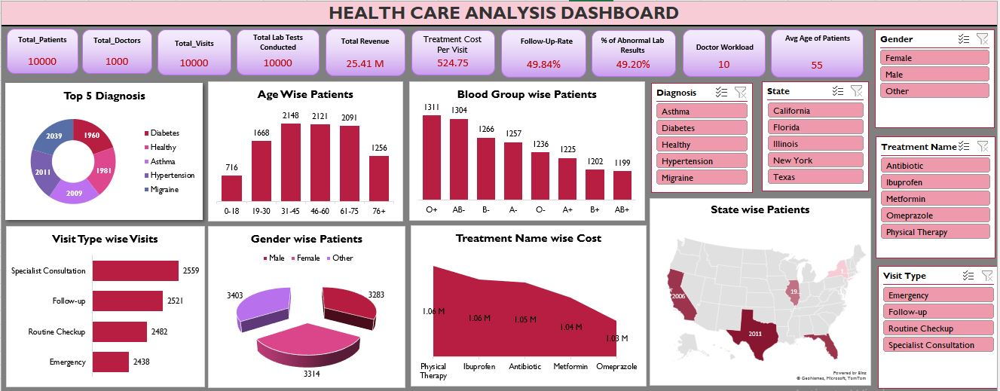

# Healthcare Analysis Dashboard - Excel 


## 📌 Overview

This project is an **Excel-based interactive Healthcare Analysis Dashboard** designed to provide a holistic view of healthcare performance. It summarizes **patient demographics, doctor workload, visit types, diagnoses, treatment costs, lab results, and geographic spread**. Slicers allow quick exploration by Gender, Diagnosis, State, Treatment Name, and Visit Type.
The dashboard uses **Power Pivot with DAX formulas** to calculate KPIs dynamically, making it fully responsive to slicer filters.

---

## 🌟 Key Features

* Comprehensive healthcare KPIs with real-time filtering
* Interactive slicers for **Gender, Diagnosis, State, Treatment Name, Visit Type**
* Visual breakdown by **age, gender, blood group, visit type, and state**
* Cost analysis for top treatments
* Geographic visualization with patient distribution map
* Powered by **DAX** for accurate, dynamic calculations

---

## 📊 KPIs & Metrics Used

* **Total Patients:** 10,000
* **Total Doctors:** 1,000
* **Total Visits:** 10,000
* **Total Lab Tests Conducted:** 10,000
* **Total Revenue:** 25.41M
* **Treatment Cost per Visit:** 524.75
* **Follow-Up Rate:** 49.84%
* **% Abnormal Lab Results:** 49.20%
* **Doctor Workload:** 10 patients per doctor
* **Average Age of Patients:** 55 years

---

## 🧮 DAX Measures Used

```DAX
-- % of Abnormal Lab Results
% of Abnormal Lab Results =
    CALCULATE(
        COUNT(Lab_result[Result]),
        Lab_result[Result] = "Abnormal"
    ) / COUNT(Lab_result[Lab Result ID])

% of Abnormal Lab Results2 =
    CALCULATE(
        COUNT(Lab_result[Test Result]),
        Lab_result[Test Result] = "Abnormal"
    ) / COUNT(Lab_result[Lab Result ID])

-- Age Groups
0-18 =
    CALCULATE(
        COUNT(Patient[Patient ID]),
        Patient[Age] <= 18
    )

19-30 =
    CALCULATE(
        COUNT(Patient[Patient ID]),
        Patient[Age] > 18 && Patient[Age] <= 30
    )

31-45 =
    CALCULATE(
        COUNT(Patient[Patient ID]),
        Patient[Age] > 30 && Patient[Age] <= 45
    )

46-60 =
    CALCULATE(
        COUNT(Patient[Patient ID]),
        Patient[Age] > 45 && Patient[Age] <= 60
    )

61-75 =
    CALCULATE(
        COUNT(Patient[Patient ID]),
        Patient[Age] > 60 && Patient[Age] <= 75
    )

76+ =
    CALCULATE(
        COUNT(Patient[Patient ID]),
        Patient[Age] > 75
    )

-- Average Age
Avg Age of Patients =
    AVERAGE(Patient.DATEDIFF(Patient[Date of Birth], TODAY(), YEAR))

-- Doctor Workload
Doctor Workload =
    COUNT(Visit[Visit ID]) / COUNT(Doctor[Doctor ID])

-- Follow-Up Rates
Follow-Up-Rate =
    CALCULATE(
        COUNT(Visit[Follow Up Required]),
        Visit[Follow Up Required] = "Yes"
    ) / COUNT(Visit[Visit ID])

Follow-up-rate2 =
    CALCULATE(
        COUNT(Visit[Follow-up Required]),
        Visit[Follow-up Required] = "Yes"
    ) / COUNT(Visit[Visit ID])
```

---

## 📷 Dashboard Snapshot



> This interactive dashboard showcases hospital performance insights with real-time filtering and drill-down capabilities.
---

## 📊 Visuals & What They Show

### 1) Top 5 Diagnosis (Donut)

* **Categories:** Diabetes, Healthy, Asthma, Hypertension, Migraine
* Purpose: Shows the most frequent diagnoses to monitor case mix and resource needs.

### 2) Age-Wise Patients (Bar)

* **Age Bands & Counts:**
  0–18: 716 · 19–30: 1668 · 31–45: 2148 · 46–60: 2121 · 61–75: 2091 · 76+: 1256
* Purpose: Understand patient distribution by age to plan capacity and specialized care.

### 3) Blood Group-Wise Patients (Bar)

* **Approx. Counts (highest to lowest range shown):**
  O+ (\~1311), AB- (\~1304), B+ (\~1266), O (\~1257), AB (\~1326), A- (\~1225), A+ (\~1202), AB+ (\~1199)
* Purpose: Inventory planning for blood-related procedures and emergencies.

### 4) Visit Type-Wise Visits (Horizontal Bars)

* **Counts:** Specialist Consultation (2559), Follow-up (2521), Routine Checkup (2482), Emergency (2438)
* Purpose: Spot service demand and balance staffing across visit types.

### 5) Gender-Wise Patients (Pie)

* **Counts (near-equal split):** \~3403, \~3314, \~3283
* Purpose: High-level demographic breakdown for equity and outreach planning.

### 6) Treatment Name-Wise Cost (Area/Bar)

* **Top Costs:** Physical Therapy (\~1.06M), Ibuprofen (\~1.06M), Antibiotic (\~1.05M), Metformin (\~1.04M), Omeprazole (\~1.03M)
* Purpose: Identify cost drivers for budgeting and cost-reduction initiatives.

### 7) State-Wise Patients (Filled Map)

* Highlights patient counts by US state (e.g., larger volumes in states like CA and TX in the snapshot).
* Purpose: Geographic spread for regional performance and outreach.

### 8) Slicers (Right Panel)

* **Gender, Diagnosis, State, Treatment Name, Visit Type**
* Purpose: One-click filters that update all visuals and KPIs for focused analysis.

---

## 📈 Key Insights (from the snapshot)

* **Balanced Visit Mix:** Specialist consultations, follow-ups, routine checkups, and emergencies are all \~2.4–2.6k—indicates diversified service utilization.
* **Mid-Age Concentration:** Largest patient groups are **31–45** and **46–60**, useful for chronic disease management programs.
* **Cost Drivers:** A handful of treatments (e.g., **Physical Therapy, Antibiotics, Metformin**) dominate spend—ideal targets for vendor negotiations and care pathway optimization.
* **High Follow-Up Rate (\~50%):** Indicates strong continuity of care; pair this with **% Abnormal Labs (\~49%)** to audit test ordering and follow-up protocols.

---

## 🛠 Tools & Technology Used

* **Microsoft Excel** – Data modeling, charts, slicers, Power Pivot
* **DAX** – Custom measures for KPIs & calculated fields
* **Excel Map Chart** – Geographic visualization
* **Pivot Tables/Charts** – Data aggregation & visual design

---

## 📂 Data Fields Used

* **Patient:** Patient ID, Age, Date of Birth, Gender, Blood Group
* **Doctor:** Doctor ID
* **Visits:** Visit ID, Visit Type, Follow-Up Required, Treatment Name, Treatment Cost, State
* **Lab Results:** Lab Result ID, Result, Test Result

---

## 🎨 Interactivity & Design

* Fully slicer-driven design for instant filtering
* KPI cards at the top for quick status overview
* Combination of **donut, bar, pie, area, and map charts** for diverse insights
* Color-coded visuals for clarity and aesthetics

---

## 🏷 Tags

`Excel` `PowerPivot` `DAX` `Data Analysis` `Healthcare` `Interactive Dashboard` `KPIs` `Data Visualization`

---

## 👤 Author

**Syed Yaseen**  
*Aspiring Data Analyst | Power BI | Excel | SQL | Tableau*

[](https://syedyaseen324.carrd.co/)

⭐ **Don't forget to star the repo if you found it helpful!**


