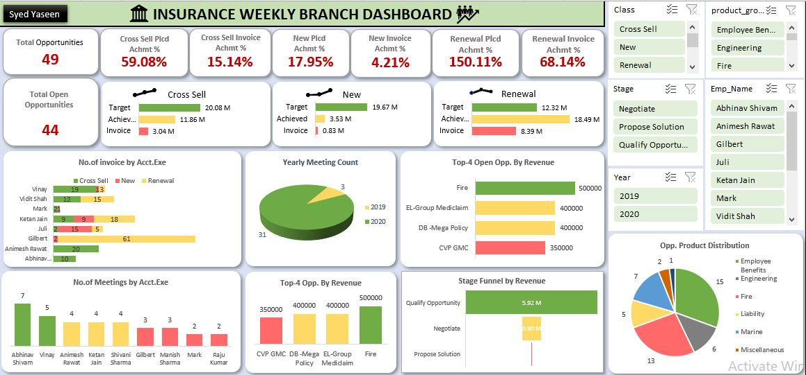

# 🏢 Insurance Branch Performance Dashboard – Excel

## 📌 Overview  
This Excel-based interactive **Insurance Branch Dashboard** provides comprehensive insights into weekly performance metrics for insurance opportunities, including **Cross-Sell**, **New Policies**, and **Renewals**. Built using **Power Query**, **Power Pivot (DAX)**, and **Pivot Charts**, it empowers sales teams and regional managers to evaluate KPIs, opportunity pipelines, employee activity, and product performance across stages and years.

---

## 🧠 Key Features

- KPI Cards for Opportunities, Target vs Achieved Revenue, and Invoices  
- Opportunity Pipeline Segmentation: Cross-Sell, New, Renewal  
- Achievement Percentage by Policy Class  
- Invoices and Meetings by Account Executives  
- Top 4 Opportunities by Revenue  
- Stage-wise Funnel Revenue Breakdown  
- Product Category-wise Opportunity Distribution  
- Interactive Slicers for Class, Stage, Employee, Product Group, and Year

---

## 📈 KPIs & Metrics Used

- **Total Opportunities:** 49  
- **Total Open Opportunities:** 44  
- **Cross-Sell Achievement:** 59.08%  
- **New Policy Placement Achievement:** 17.95%  
- **Renewal Placement Achievement:** 150.11%  
- **Invoice Achievement (Cross-Sell):** 15.14%  
- **Invoice Achievement (New):** 4.21%  
- **Invoice Achievement (Renewal):** 68.14%  
- **Top Funnel Stage Revenue:** ₹5.92M from *Qualify Opportunity*  
- **Top Performing Product:** *Employee Benefits Engineering*

---

## 📊 Dashboard Snapshot

### 🖥️ Insurance Branch Dashboard

> Visualizes opportunity distribution, revenue progress, executive performance, and product segmentation with dynamic KPIs and interactive charts.

---

## 🔍 Key Insights

- **Renewal Opportunities** have outperformed targets with a **150.11% placement rate**, indicating high customer retention.
- **New Policy Placements** and **Invoice Achievements** are underperforming, showing areas for improvement.
- **Top Revenue Opportunity**: "Fire" product category contributing ₹500K.
- **Qualify Opportunity** stage leads in funnel revenue (₹5.92M).
- **Employee Benefits** dominate product distribution with high share in opportunities.
- **Executives** like *Vinay*, *Gilbert*, and *Animesh Rawat* have strong invoice performance.
- **Years 2019 and 2020** performance tracked using meeting data split via pie chart.

---

## ⚙️ Tools & Technology Used

| Tool / Feature      | Purpose                                                            |
|---------------------|--------------------------------------------------------------------|
| **Microsoft Excel** | Platform for data processing, modeling, and visualization          |
| **Power Query**     | Data import, cleaning, and transformation                         |
| **Power Pivot**     | Data modeling and relationship management                          |
| **DAX Measures**    | Calculation of KPIs, achievement %, invoice summaries, revenue     |
| **Pivot Tables**    | Aggregating data for analysis and drill-down insights              |
| **Pivot Charts**    | Visual representations (bar, pie, column, donut)                   |
| **Slicers**         | Filters for Class, Stage, Product Group, Executive, and Year       |

---

## 📁 Data Fields Used

- Opportunity Class (Cross-Sell / New / Renewal)  
- Target Amount  
- Achieved Amount  
- Invoice Amount  
- Employee Name (Account Executive)  
- Product Group  
- Opportunity Stage  
- Year  
- Meeting Count  
- Invoice Count  

---

## 🧰 Interactivity & Design

- 💡 **Dynamic Slicers** for real-time filtering  
- 📊 **Visual Charts** including Bar, Donut, Pie, and Funnel  
- 🧮 **DAX Measures** for calculating key ratios and performance indicators  
- 🔁 **Power Query** for seamless data refresh and structured formatting  
- 🧩 **Pivot Tables** for backend aggregation and slicing  

---

## 📌 Tags

`#ExcelDashboard` `#InsuranceAnalytics` `#SalesKPI` `#PowerQuery` `#PowerPivot` `#DAX` `#InteractiveDashboard` `#DataVisualization`

---

##  Author

**Syed Yaseen**  
*Aspiring Data Analyst | Power BI | Excel | SQL | Tableau*

⭐ **Don't forget to star the repo if you found it helpful!**

